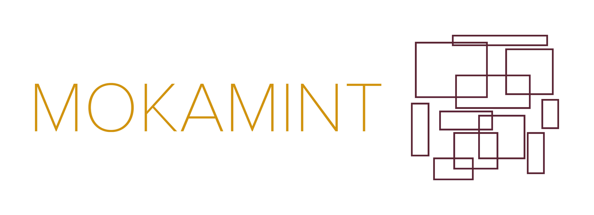

<p align="center"></p>

[](https://github.com/Mokamint-chain/mokamint/actions)
[](https://central.sonatype.com/search?smo=true&q=g:io.mokamint/io-mokamint-application-parity)
[](https://hub.docker.com/u/mokamint)
[](http://www.apache.org/licenses/LICENSE-2.0.html)

# Parity

A simple parity application running on top of the Mokamint proof of space engine

## Introduction

This parity application for Mokamint is a minimal example about the definition of an application
running on top of the Mokamint proof of space engine. It implements an application with only two states: 0 and 1.
They represents the parity of an integer value _v_: 0 means even and 1 means odd.
The value of _v_ is assumed to be initially 0 when the blockchain starts.
Transactions are additions of an integer constant to _v_. For instance, if the parity of _v_ is currently 0
(ie., _v_ is even) and a request arrives to the blockchain, to add 13 to _v_, then the parity of _v_ becomes 1, because
0 (even) plus 13 (which is odd) yields an odd value. If later, a request arrives to add 6 to _v_, then the parity
of _v_ remains 1 (odd), because 1 (odd) plus 6 (which is even) yields an odd value. If, finally, a request
arrives to add 13 to _v_ again, then the parity of _v_ becomes 0 again, because 1 (odd) plus 13 (which is odd)
yields an even value. Note that this application is normally meant to be run over a blockchain that allows
repeated requests (such as adding 13 twice, as in this example).

Below, instructions are reported about the creation of a blockchain of two nodes and the execution of
transactions on that blockchain. The docker tool is used, so that experiments can be more easily reproduced,
without having to install Mokamint.

## Start a brand new blockchain, by spawning its first node

This section shows how you can start the first node of a brand new blockchain from scratch, by minting its genesis block
and by initializing its store. Later, other nodes can join the new blockchain with the technique described later.

There is a docker image that provides scripts for starting a brand new blockchain.
These scripts include the creation of a local miner as well, or otherwise your node
would not be able to mine new blocks. Because of this, the scripts deal with two key pairs:
the former identifies the node, and is kept inside the machine running the script,
and the latter identifies the miner, it can be stored elsewhere and only its public key is needed here.

The process is consequently split in three steps:

* configure the node (`config-new`)
* initialize the node (`init`)
* run the node (`go`)

Each phase is the execution of a script inside the docker image. The scripts
`config-new` and `init` are meant to be run only once, while `go` can be run, stopped and run again,
whenever you want to start or stop the node. You can also pause it and unpause it. The reason for splitting
the process in three scripts is that that allows one to manually edit the configuration created
by `config-new` before initializing and running the node, although we won't show this here.
Moreover, having distinct scripts allows `go` to be stopped and run again, repeatedly,
whenever you want to stop and restart a node.

### Configure the node: `config-new`

The first thing to do is to create a key pair for the miner of the new node that you want to start.
You can do this by running the container and the `mokamint-node` command inside it:

```console
$ docker run -it --rm --name mokamint mokamint/mokamint:1.7.0 /bin/bash
mokamint@92d112f5a7c5:~$ mokamint-node keys create --name miner.pem --password
Enter value for --password (the password that will be needed later to use the key pair): 
The new key pair has been written into "miner.pem":
* public key: 3ExG53CrXsAsnrbxWgkBNNpME4F3YK7mho4R6RXqhoW2 (ed25519, base58)
* public key: IUpoJ0qP5IUWAcln9cSr1sGBEozALaWdazxC+uBT3Ys= (ed25519, base64)
* Tendermint-like address: F7DB9C42843560D0345C3583D8A16438FC8CFA00
```

Use the password that you like (or leave it blank). The command above
will create a key pair `miner.pem` inside the running container.
In another shell, you can transfer that key pair to your local machine:

```console
$ docker cp mokamint:/home/mokamint/miner.pem .
Successfully copied 2.05kB.
```
At this point, inside the container, give commands to
delete the key pair and exit the container:

```console
hotmoka@afbef35bce14:~$ rm miner.pem
hotmoka@afbef35bce14:~$ exit
$
```

You can configure the node now, specifying the public key of the miner:

```console
$ docker run -it --rm -v chain:/home/mokamint/chain -v mokamint:/home/mokamint/mokamint -e PUBLIC_KEY_MINER_BASE58=3ExG53CrXsAsnrbxWgkBNNpME4F3YK7mho4R6RXqhoW2 -e TARGET_BLOCK_CREATION_TIME=20000 -e PLOT_SIZE=1000 -e CHAIN_ID="panda" -e ALLOWS_REPEATED_REQUESTS=true mokamint/mokamint:1.7.0 config-new
I will use the following parameters for the creation of the configuration directory of a proof of space Mokamint node:

    ALLOWS_REPEATED_REQUESTS=true
                    CHAIN_ID="panda"
                   PLOT_SIZE=1000
     PUBLIC_KEY_MINER_BASE58="3ExG53CrXsAsnrbxWgkBNNpME4F3YK7mho4R6RXqhoW2"
  TARGET_BLOCK_CREATION_TIME=20000

Cleaning the directory mokamint... done
Cleaning the directory chain... done
Creating the node.pem key pair for signing the blocks: Enter value for --password (the password that will be needed later to use the key pair): 
done: the public key is 7M4tVKyYZXpPHoF58ZgBwyJs86iWBh9PrCAZm9BjS9dV (ed25519, base58)
Creating the Mokamint configuration file... done
Creating a plot file for the miner, containing 1000 nonces, for the chain id "panda", for a node with public key 7M4tVKyYZXpPHoF58ZgBwyJs86iWBh9PrCAZm9BjS9dV (ed25519, base58), for a miner with public key 3ExG53CrXsAsnrbxWgkBNNpME4F3YK7mho4R6RXqhoW2 (ed25519, base58)...
1% 2% 3% 4% 5% 6% 7% 8% 9% 10% 11% 12% 13% 14% 15% 16% 17% 18% 19% 20% 21% 22% 23% 24% 25% 26% 27% 28% 29% 30% 31% 32% 33% 34% 35% 36% 37% 38% 39% 40% 41% 42% 43% 44% 45% 46% 47% 48% 49% 50% 51% 52% 53% 54% 55% 56% 57% 58% 59% 60% 61% 62% 63% 64% 65% 66% 67% 68% 69% 70% 71% 72% 73% 74% 75% 76% 77% 78% 79% 80% 81% 82% 83% 84% 85% 86% 87% 88% 89% 90% 91% 92% 93% 94% 95% 96% 97% 98% 99% 100% 
done
```

Note that the public key of the miner is inserted in base58. The target block creation time, in milliseconds, is the average time between the creation of two successive blocks. The chain identifier identifies the new network. Repeated requests will be allowed in this new blockchain, which is sensible since requests in the Parity application are not distinguished by a progressive nonce.

The script above prompts for the password of the key pair used for signing the new blocks. Enter your chosen password here, possibly distinct from that chosen for the miner, or just leave it blank. The script has configured the node and created a plot file for its miner.

### Initialize the node: `init`

### Run the node: `go`

## Join an existing blockchain, by spawning a new node that clones an existing node

### Configure the node: `config-clone`

### Run the node: `go`

## Further information

&nbsp;

<p align="center"></p><p align="center">This document is licensed under a Creative Commons Attribution 4.0 International License.</p>

<p align="center">Copyright 2026 by Fausto Spoto (fausto.spoto@mokamint.io).</p>